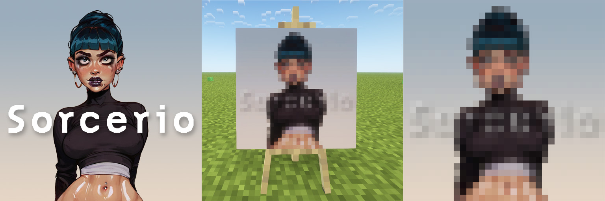

# Joy of Painting Conversion Tool

- [Joy of Painting Conversion Tool](#joy-of-painting-conversion-tool)
  - [Overview](#overview)
  - [Install](#install)
  - [Usage](#usage)
  - [Importing and Exporting from Minecraft](#importing-and-exporting-from-minecraft)
  - [Export from the Game](#export-from-the-game)
  - [Import to the Game](#import-to-the-game)

---

## Overview

This tool allows for import and export of images for use with the [Joy of Painting](https://www.curseforge.com/minecraft/mc-mods/joy-of-painting) Minecraft mod.

Any image painted in game (`.paint`) can be exported and converted in to a normal image format like `.png`.

Any normal image (like `.png`, `.jpg`, etc) can be imported into the game at an appropriate resolution for the Joy of Painting canvases in-game.
Large images can also be imported as a grid to increase the represented resolution by combining multiple Joy of Painting canvases.

## Install

1. Ensure Python 3 is installed on your system.
1. Create a Python virtual environment: `python -m venv .venv --prompt Paint`.
1. Enter the Python virtual environment: `./.venv/Scripts/activate`.
1. Install dependencies: `pip install -r requirements.txt`

## Usage

1. Make sure you're in your Python virtual environment: `./.venv/Scripts/activate`.
1. Run the command line interface with: `python run.py`.

You can now export existing `.paint` files into a normal image format or import any normal image into the `.paint` format to use in-game.

## Importing and Exporting from Minecraft

Refer to the description of the [Joy of Painting](https://www.curseforge.com/minecraft/mc-mods/joy-of-painting) mod for more information.

## Export from the Game

To export a held painting in game, type `/paintexport <filename>` (_do not include an extension_) into the chat.
The file will then appear within your Minecraft directory in a new `paintings` directory.
From there, you can use this tool's `export` mode to convert the image to a normal image format.

## Import to the Game

To import a painting created with this tool from your `.../minecraft/paintings` directory, hold a _complete_ palette in your off-hand and an appropriately sized canvas in your main-hand.
With the items held, type `/paintimport <filename>` (_do not include an extension_) and the painting will be imported to the held canvas.
